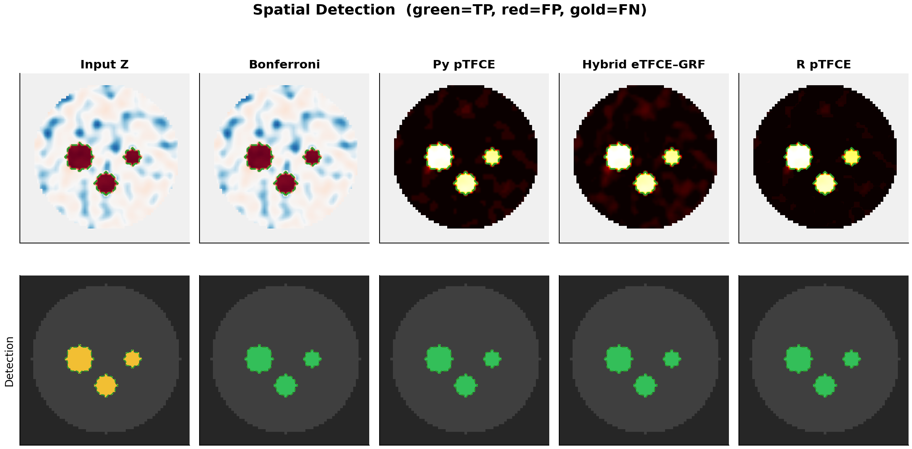
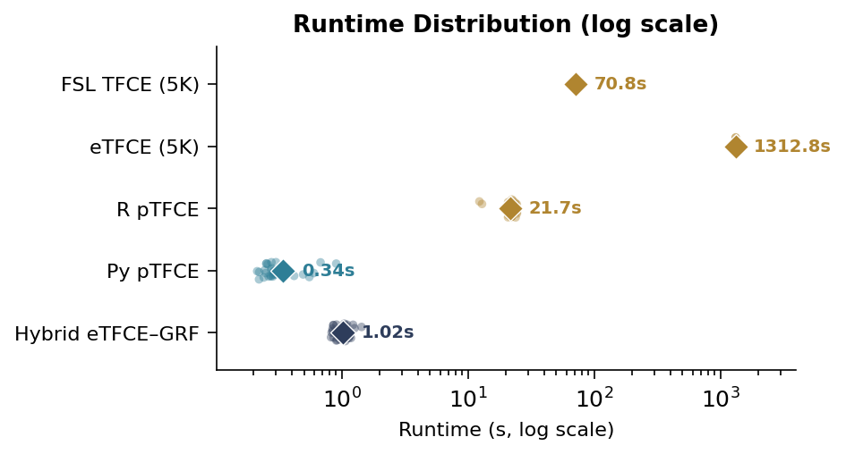

# pytfce

Fast probabilistic Threshold-Free Cluster Enhancement in Python.

## Overview

`pytfce` is a pure-Python package for probabilistic TFCE (pTFCE), providing analytical inference on neuroimaging statistical maps without permutation testing. It implements a baseline pTFCE faithful to the original R package (Spisák et al. 2019) and a novel hybrid eTFCE–GRF that combines union-find cluster retrieval with analytical GRF p-values. On real brain data (~2M voxels), `pytfce` is 73× faster than the R pTFCE package while producing concordant results.

## Installation

```bash
pip install pytfce

# development install
git clone https://github.com/Don-Yin/pytfce.git
cd pytfce
pip install -e .
```

**Dependencies:** NumPy, SciPy, connected-components-3d (installed automatically).

## Quick start

```python
import nibabel as nib
from pytfce import ptfce_baseline, ptfce_exact

img = nib.load("zstat1.nii.gz")
Z = img.get_fdata()
mask = Z != 0  # or load a proper brain mask

# --- baseline pTFCE (fast, matches R pTFCE) ---
result = ptfce_baseline(Z, mask)

# --- hybrid eTFCE–GRF (exact cluster retrieval) ---
result = ptfce_exact(Z, mask)

# result keys:
#   result["p"]           — enhanced p-values (3-D array)
#   result["logp"]        — −log10(p) for visualization
#   result["Z_enhanced"]  — enhanced Z-scores
#   result["smoothness"]  — estimated smoothness dict
```

## Variants

| Variant | Method | Speed (2M vox) | Best for |
|---------|--------|---------------:|----------|
| `ptfce_baseline` | pTFCE (threshold grid + CCL) | ~5 s | Standard use, small–medium volumes |
| `ptfce_exact` | eTFCE–GRF (union-find + GRF) | ~84 s | Large volumes, finer threshold grids |

Both variants use identical GRF p-values and aggregation. The baseline sweeps a threshold grid with connected-component labelling at each level; the hybrid uses a single union-find sweep, eliminating discretisation error at the cost of higher constant overhead.

## Validation

**Spatial detection** — Phantom study (64³ volume, 80 subjects, 3 embedded blobs). All pTFCE variants achieve Dice = 1.0:



**Runtime** — Log-scale comparison across five methods (emulated phantom). Py pTFCE runs in 0.34 s vs 21.7 s for R pTFCE (64× speedup):



## API reference

| Function | Description |
|----------|-------------|
| `ptfce_baseline(Z, mask, ...)` | Baseline pTFCE with LUT-accelerated GRF p-values |
| `ptfce_exact(Z, mask, ...)` | Hybrid eTFCE–GRF via union-find + analytical GRF |
| `estimate_smoothness(Z, mask)` | Estimate image smoothness (FWHM) from a Z-score map |
| `estimate_smoothness_from_residuals(Y, X, mask)` | Estimate smoothness from GLM residuals |
| `fwer_z_threshold(n_resels, alpha)` | GRF Euler-characteristic FWER Z-threshold |
| `pvox_clust(V, Rd, c, h)` | P(Z ≥ h \| cluster_size = c) via GRF Bayes' rule |
| `aggregate_logpvals_vec(s, delta)` | Vectorised Q-function for log-probability aggregation |

## Citation

If you use `pytfce` in your research, please cite:

```bibtex
@article{pytfce2026,
  author  = {Yin, Don and Chen, Hao},
  title   = {pytfce: {Fast} probabilistic {Threshold-Free Cluster Enhancement}
             in {Python}},
  journal = {Journal of Open Source Software},
  year    = {2026},
  doi     = {10.21105/joss.XXXXX}
}
```

## License

MIT
